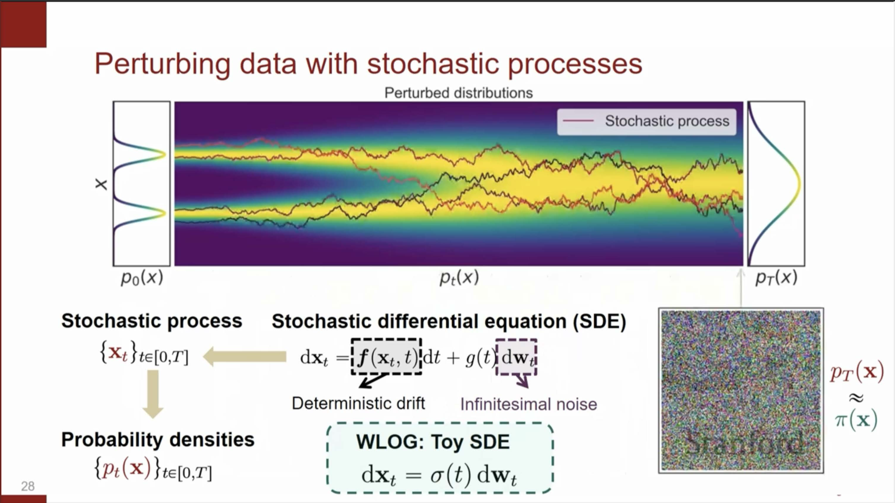
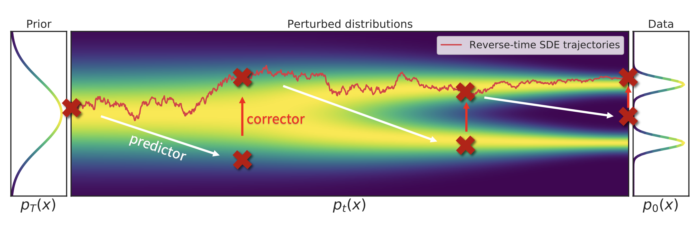

# Deep understanding about diffusion models

## TL;DR

This article discusses a general fluid mechanic based diffusion framework, which can be used to easily derive DDPM, DDIM, Predictor–Corrector, flow matching, etc.

## What’s a diffusion model?

We describe diffusion as a process that perturbs images so their distribution drifts from the real data distribution toward pure Gaussian white noise.
As shown in the figure, images move from left to right, transforming the distribution from $p_0(x)$ to $p_T(x)$.

Figure source: Stanford XCS236

Conversely, during inference we can sample a point from Gaussian white noise and transform it back toward $p_0(x)$, i.e., the real data distribution, to generate high-fidelity images.

---

## Dynamic equation

The process that an image moves from left to right implies a stochastic dynamic described by an SDE (stochastic differential equation).

#### Forward ($x_0 \rightarrow x_T$)

$dx = f(x, t)dt + g(t)dW$ (1)

* **Micro perspective:** $f(x, t)$ represents the deterministic drift (mean shift), while $g(t)$ controls the magnitude of the stochastic noise term $\mathrm{d}W$. Together, they describe how a particle moves to the right, influenced by both a time-dependent drift and random fluctuations.
* **Macro perspective:** how $p_{\text{data}}(x)$ is transformed to $\mathcal{N}(0, I)$.

#### Backward ($x_T \rightarrow x_0$)

$dx = [f(x, t) - g^2(t) \nabla_x \log p(x,t)]dt + g(t)dW$ (2)

This reverse process samples a Gaussian noise, then move backwards to the leftmost $x_0$, which represents a sample with distribution $p_{\text{data}}(x)$.

> The forward process is entirely under our control: we specify $f(x, t)$ and $g(t)$ (subject to initial condition constraints). If we can accurately estimate the score function $\nabla_x \log p(x, t)$, then all terms in Eq.(2) become known, making the backward process fully tractable.

### Fokker–Planck equation

The SDEs above correspond to the following Fokker–Planck (FP) PDE:

$\frac{\partial p(x,t)}{\partial t} = - \nabla_x \cdot \big( f(x,t) \, p(x,t) \big) + \tfrac{1}{2} g^2(t) \nabla_x^2 p(x,t)$ (3)

which links microscopic motion ($f(\cdot)$, $g(\cdot)$) to macroscopic probability flow ($p(x, t)$).

Applying FP to Eq.(1) and Eq.(2), we can equivalently write a family with a free noise scale $\sigma(t)$:

#### Forward ($x_0 \rightarrow x_T$)

$dx = [f(x, t) - \frac{1}{2}(g^2(t) - \sigma^2(t))\nabla_x \log p(x,t)]dt + \sigma(t)dW$ (4)

#### Backward ($x_T \rightarrow x_0$)

$dx = [f(x, t) - \frac{1}{2}(g^2(t) + \sigma^2(t))\nabla_x \log p(x,t)]dt + \sigma(t)dW$ (5)

Notes:

* (1)–(4) share the same $p(x,t)$: the same data distribution can be diffused by different dynamics.
* Compared to Eq(1) and Eq.(2), Eq.(3) and Eq.(4) introduce a free $\sigma(t)$, i.e., a new diffusion variance.

By choosing different $f(\cdot)$, $g(\cdot)$, and $\sigma(\cdot)$, we can easily cover many classic algorithms.

---

## Score-matching–based diffusion

When $g(t)\neq 0$ in (1)–(2) or $\sigma(t)\neq 0$ in Eq.(3) and Eq.(4), methods fall into score matching diffusion because they require $\nabla_x \log p(x,t)$.

### Training

We learn the score via Fisher divergence:

$$\mathbb{E}[\left \lVert \nabla_x \log p(x,t) - S_\theta(x, t) \right \rVert_2^2] = \mathbb{E}_{x \sim p_{\text{data}}, \tilde{x_t} \sim q_\phi(\tilde{x_t} \vert x_0)} [\left \lVert S_\theta(x, t) + \frac{x - \tilde{x_t}}{\sigma^2} \right \rVert_2^2]$$ (6)

which is tractable through Monte-Carlo estimation.

### Inference

#### Probability flow ODE

Setting $\sigma(t)=0$ in Eq.(3) and Eq.(4) yields the **probability flow ODE**.

#### DDPM (VP-SDE)

Let $f(x, t) = -\tfrac{1}{2}\beta(t)x$, $g(t) = \sqrt{\beta(t)}$, and select $\sigma(t)$ according to the variance-preserving (VP) family. With these choices, the SDE becomes the variance-preserving SDE (VP-SDE). By discretizing this SDE, one recovers the formulation used in the original DDPM paper.

#### DDIM

With $f(x,t) = -\tfrac{1}{2}\beta(t)x$, $g(t)=\sqrt{\beta(t)}$, and $\sigma(t)=0$, the dynamics reduce to an ODE (probability flow ODE). In practice, comparing with DDPM, which sticks with the same $\Delta t$ as training, DDIM uses a larger $\Delta t$ at inference time to accelerate sampling.

#### Annealed Langevin Sampling (VE-SDE)

With $f(x,t)=0$ and $g(t)=\sqrt{\tfrac{\mathrm{d}}{\mathrm{d}t}\sigma^2(t)}$, the SDE becomes **variance-exploding SDE**. Since the mean stays constant (no drift), ALS mainly adjusts variance and often serves as the **Corrector** in Predictor–Corrector (PC).

Figure source: Stanford XCS236

In PC, the Corrector is vertical (no time motion), while the Predictor (with $f\neq 0$) advances along time.

---

## Flow-matching–based diffusion

Score-matching methods require estimating the score function $\nabla_x \log p(x,t)$ by injecting noise, which can make training more challenging. In contrast, flow matching is noise-free and does not require score estimation. Most of the modern SOTA models, such as consistency models, are based on this approach.

When $g(t)=0$, (1)–(2) reduce to ODEs:

* Forward: $\mathrm{d}x = f(x,t)\,\mathrm{d}t$
* Backward: $\mathrm{d}x = f(x,t)\,\mathrm{d}t$

At this point, the focus shifts from learning an accurate score function to learning a better vector field $f(x, t)$, which is generally easier. Let's begin by discussing discrete flows.

### Discrete flow model

Assume a sequence $x_k \rightarrow x_{k-1} \rightarrow \cdots \rightarrow x_0$ with invertible maps. By change of variables,

$\log p_x(x_0) = \log p_{x_k}(x_k) + \sum_{i=1}^k \log \vert \det \frac{\partial x_k}{\partial x_{k-1}} \vert$ (7)

### Continuous flow model (CNF)

Let time from discrete $T \rightarrow T-1 \rightarrow \cdots \rightarrow 0$ to continuous $t\in[0,T]$. Then

$\log p_x(x_0) = \log p_{x_k}(x(T)) - \int_0^T \text{Tr}\left(\frac{\partial f(x, t)}{\partial x}\right)dt$ (8)

conduct partial derivitive along time dimension,

$\frac{\partial}{\partial t} \log p(x_t \mid x_0) = - \nabla_x \cdot f(x_t, t)$ (9)

Equivalently,

$\frac{\partial}{\partial t} p_x(x_0) = - \nabla_x \cdot \big( p_x(x_0) f(x, t) \big)$ (10)

### Continuity equation

A classic fluid-mechanics identity:

$\frac{\partial}{\partial t} p(x, t) + \nabla_x \cdot \big( p(x, t) f(x, t) \big) = 0$ (11)

This can also be derived from the FP equation (Eq.(3)) by setting $g(t)=0$. There are other ways to interpret this equation, which won't be elaborated here for simplicity. 

### Flow matching objective

We aim to choose a learnable field $V_\theta(x,t)$ that matches $f(x,t)$:

$$\mathbb{E}_{x_t \sim p(x, t)} \left[ \left \lVert V_\theta(x, t) - f(x, t)\right \rVert _2^2 \right] = \mathbb{E}_{x_0 \sim p_{\text{data}}, x_t \sim p(x, t \vert x_0)} \left[ \left \lVert V_\theta(x, t) - f(x, t \vert x_0)\right \rVert_2^2 \right]$$ (12)

The right-hand side replaces the intractable sampling of $x_t \sim p(x, t)$ with a tractable alternative: sampling $x_t \sim p(x, t \vert x_0)$, where $x_0$ is drawn from the data distribution (the reason for this tractability will be explained shortly). As an example, consider the following simple linear path for $t \in [0, 1]$:

$\Phi_t(x_0, x_1) = (x_1 - x_0)t + x_0$ (13)

$f(x, t \vert x_0) = \frac{\partial \Phi_t(x_0, x_1)}{\partial t} = x_1 - x_0$ (14)

Plugging into the continuity equation (Eq.(11)) yields

$$\frac{\partial}{\partial t} p(x, t \vert x_0) + \nabla_x \cdot ( p(x, t \vert x_0) (x_1 - x_0) ) = 0$$ (15)

Define

$\nabla_{(x, t)} = [\nabla_{x}, \frac{\partial}{\partial t}]$, $u = [p(x, t \vert x_0) (x_1 - x_0), p(x, t \vert x_0)]$ (16)

so the PDE (partial derivative equation) becomes

$\nabla_{(x,t)} \cdot u = 0$ (17)

Resolving this first-order PDE yields $p(x,t\mid x_0)$.

Since we can sample $x_0 \sim p_{\text{data}}$ and $x_t \sim p(x, t \vert x_0)$, the flow-matching loss in Eq.(12) is trainable via Monte Carlo estimation (in practice, rejection sampling is one option to generate $x_t$).

---

### Numerical methods

During inference, discretize your chosen SDE/ODE (e.g., Euler–Maruyama for SDEs, Euler/Heun for ODEs) to generate samples.

