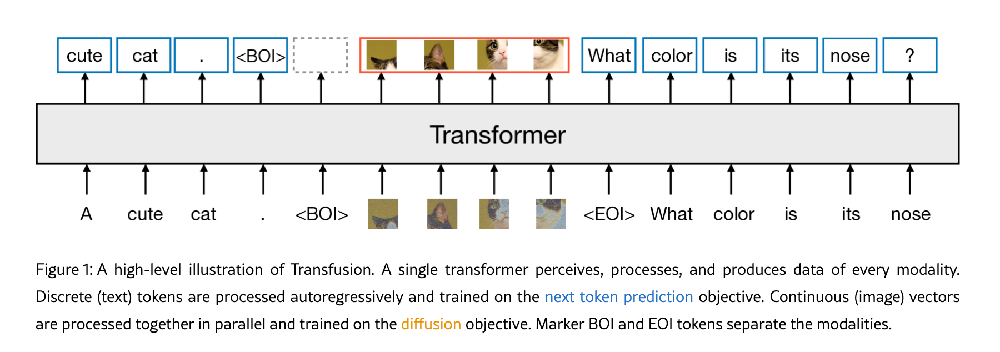
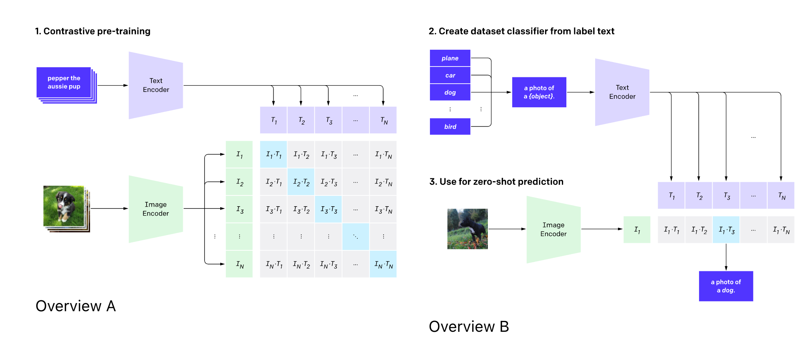
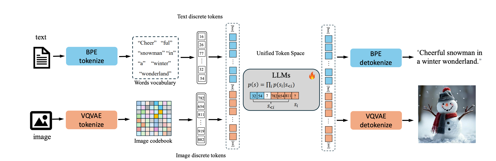
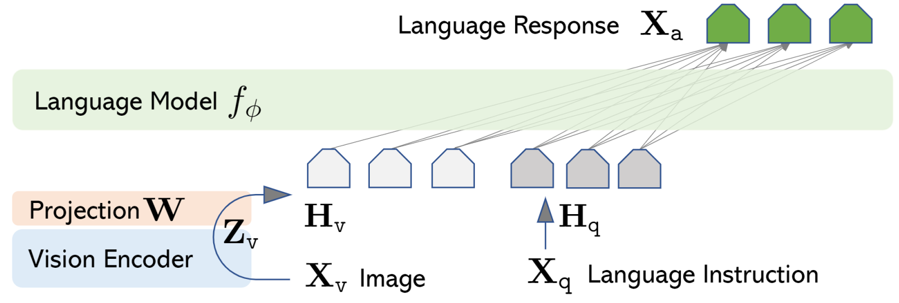
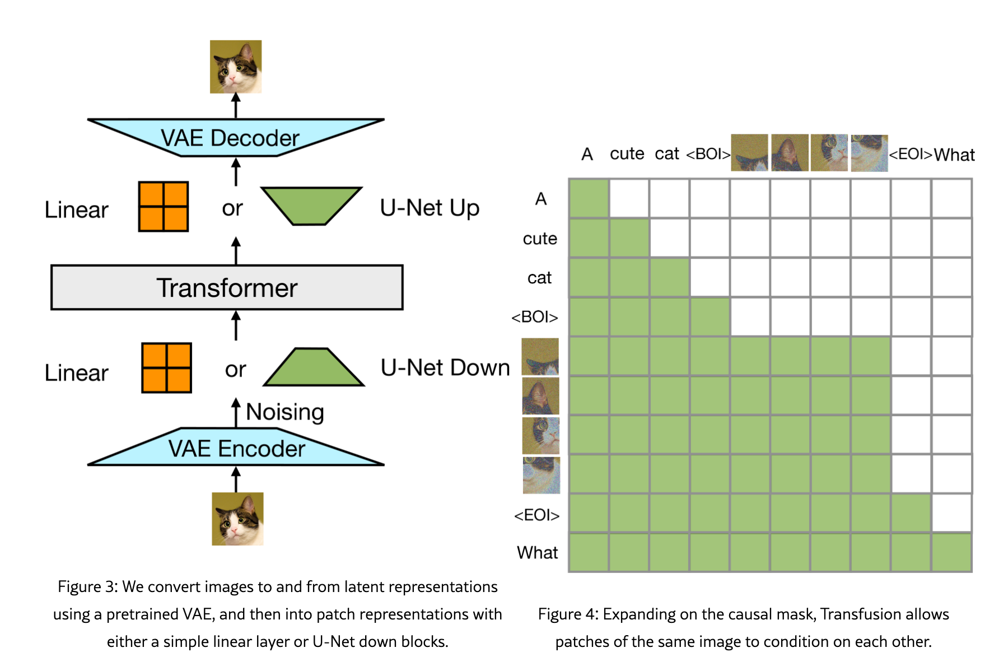
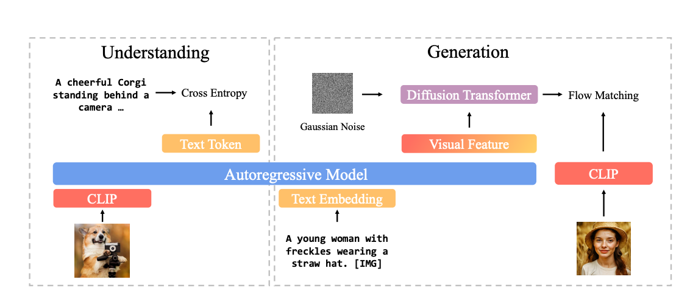
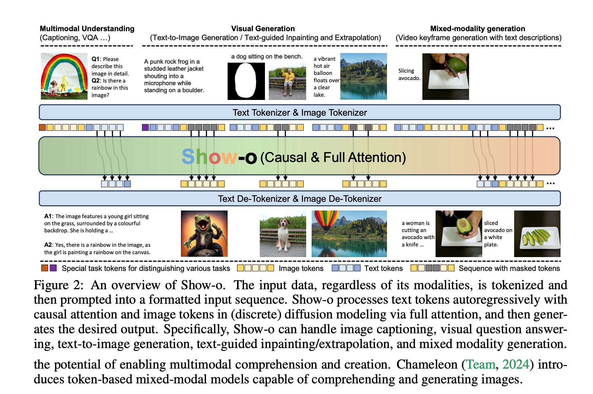
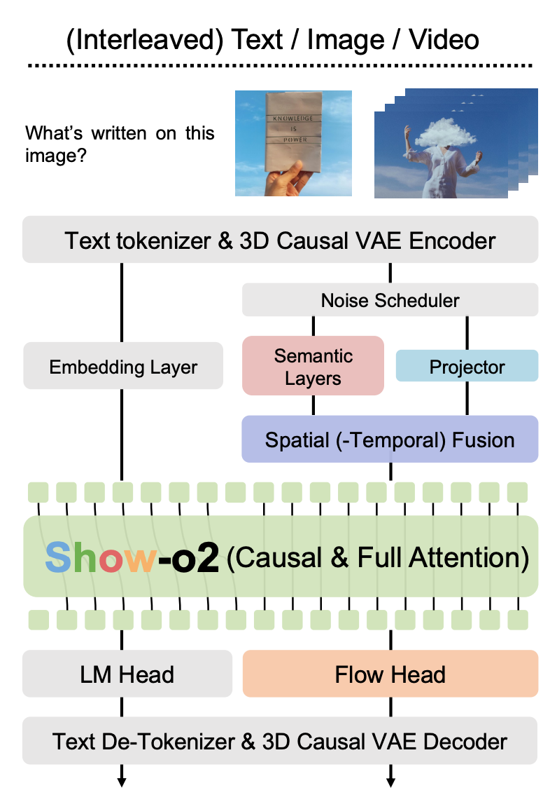
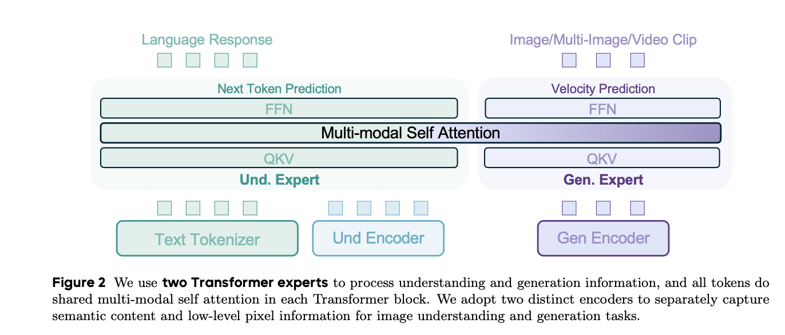

## Summary: Unified Multimodal Generation & Understanding (2025.09)

### 1. Typical design choices for unified multimodal generation and understanding models

Current VLM approaches follow three main paths:

1. Quantized autoregressive

   - This approach designs a codebook for images and uses the code vectors to represent image patches. This creates a "visual embedding" analogous to "word embeddings," discretizing image tokens. Doing so makes images and language easier to integrate in LLMs.

   - However, the codebook reduces the information entropy from infinity (a continuous visual space) to codebook entropy $$K\log{V}$$, where $$K$$ is the code dimensionality and $$V$$ is the vocabulary size. This approach scales poorly, especially in character‑intensive tasks (e.g., OCR).

2. External diffusion model

   - To address the above issues, an alternative is to let the backbone LLM consume and produce continuous image vectors, preserving the continuity of the visual space. Inputs to the LLM can be encoded by CNN/VAE/CLIP/SigLIP, etc. The outputs are continuous latent vectors that are decoded by a separate DLM (diffusion language model).

   - However, this typically requires training a separate diffusion decoder, so the system is not end‑to‑end. It is also arguably less elegant and runs counter to "[the bitter lesson](http://www.incompleteideas.net/IncIdeas/BitterLesson.html)": simpler, more general methods tend to scale better.

3. Integrated transformer

   - Some methods therefore integrate diffusion directly into the backbone transformer, so the same model handles both language and image generation.
   
   
   - When generating text, the LLM uses a causal attention mask and next‑token prediction. When generating images, the model applies bidirectional attention and predicts Gaussian noise (score matching) or a velocity field (flow matching) to progressively denoise the image; the denoised output is then fed back as input for the next round of diffusion (see Fig below).
   
   

Additionally, due to the distinct requirements of image understanding (semantic comprehension) and image generation (pixel-level fidelity), strong models often incorporate specialized image encoders tailored for each purpose.

- Semantic encoders: CLIP, BLIP, SigLIP, SigLIP2
- Pixel-level encoders: GAN, VAE, VQ-GAN, VQ-VAE, naive CNN(optional add UNet)

### 2. Method comparison

Below is a summary of the main SOTA models from this year and last year.

| Method | Publish Date | Encoder(s) | Decoder(s) | Base model | Diffusion (score/flow/No) | Diffusion native/extra DLM |
|--------|-------------|------------|------------|------------|---------------------------|----------------------------|
| [Transfusion](https://arxiv.org/html/2408.11039v1) | 2024.08 | VAE/VAE+UNet | VAE/VAE+UNet | Transformer | Score matching | Native |
| [Show-o](https://arxiv.org/pdf/2408.12528) | 2024.08 | Image vector discretization | Discrete diffusion | Transformer | discrete score matching | Native |
| [Show-o2](https://arxiv.org/pdf/2506.15564) | 2025.06 | Pixel: 3D causal VAE Semantic: SigLIP | 3D causal VAE | QWen2.5 VL | flow matching | Native |
| [BLIP3-o](https://arxiv.org/pdf/2505.09568) | 2025.05 | CLIP | DLM | QWen2.5-VL | flow matching | DLM |
| [BAGEL](https://arxiv.org/pdf/2505.14683) | 2025.05 | Pixel: VAE; Semantic: SigLIP2 | direct logits | QWen2.5 LLM | flow matching | Native |

Notes
- “score” refers to DDPM-style score matching; “flow” refers to flow matching methods.
- “extra DLM” denotes that image generation uses a separate diffusion language model as a decoder, v.s. the backbone model natively support diffusion task (noise/velocity field prediction).

### 3. Current trends

- Increasingly, models leverage both semantic encoders (for understanding) and pixel-level decoders (for generation), with a trend toward unifying these components into a shared vector representation.
- Flow matching is becoming the preferred approach over score matching, offering more stable scaling and improved training efficiency.
- There is a clear shift away from vector quantization to continuous representation for the sake of higher-fidelity image generation.
- Most models shift from extra DLM decoder to diffusion native framework.

### 4. Detailed Explanations: Encoders, Decoders, and Backbone Models

1. **Encoders**

   - **Semantic Encoders:**
     - **CLIP:** Bridges the semantic gap between text and images via contrastive learning. For more details, see [OpenAI CLIP](https://openai.com/index/clip/).

       

     - **BLIP:** An enhanced version of CLIP that introduces ITM (image-text matching for finer-grained alignment) and LM (language prediction task for better text generation).
     - **SigLIP:** Further improves upon CLIP by replacing the softmax contrastive loss with a pairwise sigmoid loss, decoupling positive and negative samples and making them i.i.d. during training. The original paper also discusses GPU optimizations, which are not covered here.
     - **SigLIP2:** Extends SigLIP with additional objectives (e.g., captioning, self-supervision), and provides improved localization and denser feature representations.

   - **Pixel-Level Encoders:**
     - **ViT:** Utilizes a transformer architecture to directly represent raw image pixels.
     - **VAE:** Compresses images into a Gaussian latent space; the 3D causal variant supports spatio-temporal tokens for both images and videos.
     - **GAN:** Employs a bi-directional GAN to map images to and from a Gaussian latent space.
     - **Vector Quantization (VQ-VAE, VQ-GAN, etc.):** These methods construct a codebook analogous to a text dictionary, mapping continuous image vectors to embedding vectors.

       

2. **Decoders**

   - **Diffusion Decoders:** Accept latent conditions as input and perform diffusion over noise (e.g., DDIM, DDPM) or velocity fields (e.g., Rectified Flow) to progressively recover high-fidelity images.
   - **VAE/GAN Decoders:** Reconstruct images from latent codes, effectively reversing the encoding process of VAEs or GANs.
   - **VQ-VAE/VQ-GAN Decoders:** Similar to the above, but operate on discrete codebook indices.

3. **Base Models**
   - **QWen2.5-VL:** A decoder-only vision-language model backbone, widely adopted in current research. QWen is currently the leading open-source model on Hugging Face.
   - **Transformer:** The standard transformer architecture, serving as the backbone for many multi-modal models.

### 5. Detailed explanations about methods

#### LLaVA

Encoder: ViT

LLaVA doesn't have image generation capability so strictly speaking it's not an omni mutli-modal model.

####  Transfusion

Very classic and solid work, AFAIK the first work which combines next-token-prediction and image-denoising work in one model.

In the paper, it also mentions it's worth trying to replace score matching with flow matching, which inspires many follow-up papers.

#### BLIP3-o

- Encoder: CLIP
- Decoder: flow matching based DLM
- Base: QWen2.5-VL.

#### Show-o

- **Encoder:** Vector quantization.
- **Decoder:** Separate discrete diffusion transformer
- **Base Model:** Transformer
- **Notes:** The reliance on VQ introduces an information bottleneck, limiting the entropy and expressiveness of generated images. This constrains visual fidelity and hampers text-conditioned image editing and generation capabilities. I personally believe that's the reason why the paper reports no results for editing/generate images with text contents.

#### Show-o2

- **Fused Encoder:**
  - **3D Causal VAE:** Encodes images and videos into spatio-temporal latent representations, enabling unified modeling of both modalities.
  - **Semantic Module $S(\cdot)$:** Distilled from SigLIP, this module operates on noised latents and is trained via rectified flow matching to align with SigLIP features even under noise perturbation:
    - **Rectified Flow Matching:** The latent at time $t$ is given by
      $$\mathbf{x}_t = t\,\mathbf{x}_1 + (1-t)\,\mathbf{x}_0, \qquad \mathbf{x}_0 \sim \mathcal{N}(0,1),\quad t\in[0,1]$$
    - **Distillation Loss:** The $S(\cdot)$ is trained to match SigLIP features on clean images:
      $$\mathcal{L}_{\text{distill}} = - \sum \log \text{sim}\!\big(S(\mathbf{x}_t),\, \mathrm{SigLIP}(\mathbf{X})\big)$$
      Here X represents $x_1$. This enables robust semantic encoding even for noised or partially denoised visual latents.
  - **Fusion:** The outputs of the 3D causal VAE and the semantic module are concatenated to form the final fused encoder representation.
  
- **Decoder:** Transformer-based, equipped with adaLN-Zero for time conditioning, and trained with flow matching objectives. This design is conceptually similar to a flow-matching "transfusion" architecture, enabling seamless integration of understanding and generation.

- **Base Model:** QWen2.5-VL.

#### BAGEL

- [Homepage](https://bagel-ai.org/)
- [Paper (arXiv:2505.14683)](https://arxiv.org/pdf/2505.14683)
- [Code](https://github.com/ByteDance-Seed/Bagel/tree/main)

- **Encoder:**  
  - Pixel encoder: VAE encodes images into latent representations.  
  - Semantic encoder: SigLIP2 extracts high-level semantic features.

- **Decoder:**  
  - No explicit image decoder; instead, a feed-forward network (FFN) directly predicts the velocity field for flow matching (based on the paper and code readout).

- **Base model:**  
  - QWen2.5-VL backbone with 2D RoPE positional encoding.

- **Architecture highlights:**  
  - Mixture-of-Transformer-Experts (MoT): Each transformer block contains separate FFN experts for text and image generation, allowing modality-specific processing and improved multi-modal reasoning.

