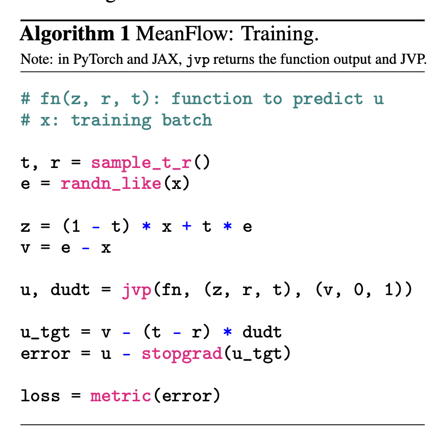
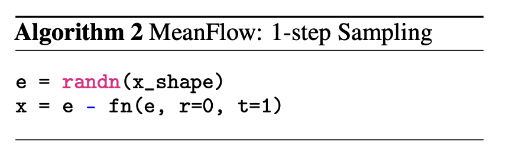

# 2025 NeurIPS Oral: Mean Flows for One-step Generative Modeling
Date: 09/21/2025

Prerequisite: understand flow matching models (see [Deep understanding about diffusion models](../../diffusion/) if you want!)

Paper link: https://arxiv.org/pdf/2505.13447
This paper is marked as NeurIPS Oral these days. This is another impressive contribution from Kaiming's team. This paper proposes replacing the instantaneous velocity field with an average velocity, enabling one-step ODE-based generation.

## Background

As discussed in [Deep understanding about diffusion models](../../diffusion/), in flow matching we learned a $V_{theta}(x, t)$ which can predict the  instantaneous velocity given $t$ and $x_t$. However, in order to generate an image $x_0$ from gaussian random noise $x_1$, we need to do a multi-step ODE $dx = V_{theta}(x, t)dt$ which gradually moves $x_1$ to $x_0$. This "multi-step" generation is slow and resource consuming. Some works (such as consistency model) tries to resolve this issue by training  a one-step predictor $v_\theta(z_t, t)$ by fitting the field lines of an ODE flow, which is generated by $dx = V_{theta}(x, t)dt$ dynamic. This kind of method is not fundamental and is more like a distillation over muti-step teacher model.

## Proposed Method

Alternatively, in this paper it proposes a mathematical method to precisely calculate the one-step predictor, instead of using teacher model to generate it. Then, a trained model can be used to fit this precise result.

Defining the mean velocity:

$$u(z_t, r, t)=\frac{1}{t-r}\int_{r}^{t}v(z_\tau, \tau)d\tau \tag{1}$$

which is an average velocity over time dimension. Here $v(z_\tau, \tau)$ is the instantaneous velocity, $u(z_t, r, t)$ represents the average velocity from time $r$ to time $t$, with destination as $z_t$.

However, it is intractable to directly learn $$\left \lVert u_{\theta}(z_t, r, t) - u(z_t, r, t) \right \rVert$$ from Eq.(1), primarily because computing integrals over functions is much more challenging than working with derivatives. **The key contribution of this paper is to rewrite Eq.(1) in a differential form (Eq.(7)), making it feasible to train a one-step model $u_\theta(z_t, r, t)$ very precisely.**

### Inference

 After we get trained function $$u_\theta(z_t, r, t)$$, we can just use $$x_1= x_0 + (1 - 0)u_\theta(x_1, 0, 1)$$ to acquire $x_0$ from $x_1$ **in one step**. 

### From intractable to tractable

Let's start from the definition of the mean velocity:

$$(t-r)\,u(z_t,r,t)=\int_r^t v(z_\tau,\tau)\,d\tau \tag{2}$$

According to the chain rule, the derivative of $u(z_t, r, t)$ with respect to $t$ is:

$$\frac{\partial}{\partial t}u(z_t,r,t) = \frac{\partial u}{\partial z_t}\frac{\partial z_t}{\partial t} + \frac{\partial u}{\partial r}\frac{\partial r}{\partial t} + \frac{\partial u}{\partial t} \tag{3}$$

Substituting Eq.(3) with:
$$\frac{d z_t}{dt}=v(z_t,t),\quad \frac{d r}{dt}=0$$
we get:

$$\frac{d}{dt}u(z_t,r,t)=\frac{\partial u}{\partial z_t} v(z_t,t)+\frac{\partial u}{\partial t} \tag{4}$$

Next, we will compute $\frac{\partial u}{\partial t}$ from Eq.(2).

Returning to Eq.(2): $(t-r)\,u(z_t,r,t)=\int_r^t v(z_\tau,\tau)\,d\tau$, take the total derivative with respect to $t$ on both sides:

**LHS:** Using the product rule,

$$\frac{\partial}{\partial t}\bigl[(t-r)\,u(z_t,r,t)\bigr] =\frac{\partial(t-r)}{\partial t}\cdot u+(t-r)\frac{\partial u}{\partial t} = u+(t-r)\frac{\partial u}{\partial t}$$

**RHS:** By the fundamental theorem of calculus, differentiating the integral with respect to the upper limit $t$ gives the integrand evaluated at $t$. Here, the integrand is $v(z_\tau,\tau)$, so at $\tau=t$ it becomes $v(z_t,t)$:

$$\frac{\partial}{\partial t}\int_r^t v(z_\tau,\tau)d\tau = v(z_t,t)$$

Therefore, Eq.(2) becomes

$$u(z_t,r,t)+(t-r)\frac{\partial u}{\partial t}= v(z_t,t) \tag{5}$$

Rewriting this gives:

$$\frac{\partial u}{\partial t} = \frac{ v(z_t,t) - u(z_t,r,t)}{t-r} \tag{6}$$

Now, replacing $\frac{\partial u}{\partial t}$ in Eq.(4) with the expression from Eq.(6), we arrive at the core of this paper—the **MeanFlow Identity**:

$$u(z_t,r,t)=v(z_t,t)-(t-r)\frac{\partial}{\partial t}u(z_t,r,t) \tag{7}$$

Equation (7) is the differential form of Equation (1). Conversely, Equation (1) can be obtained from Equation (7) by solving a simple partial differential equation (PDE).

### Training

#### Training Target

During training step in $$\left \lVert u_{\theta}(z_t, r, t) - u(z_t, r, t) \right \rVert$$, to acquire $$u(z_t,r,t)$$ from $$v(z_t,t)$$ and $$\frac{\partial}{\partial t}u(z_t,r,t)$$, we use a bootstrap method. Namingly, we use $$u_\theta(z_t,r,t)$$ as a rough estimation of $$u(z_t,r,t)$$, then we can transform Eq.(7) to:

$$u_{tgt} = v(z_t,t)-(t-r)\frac{\partial}{\partial t}u_\theta(z_t,r,t) \tag{8}$$

Here $$u_{tgt}$$ is a rough estimation of $$u(z_t,r,t)$$. Then the training target can be further rewritten as:

$$\underset{\theta}{\text{argmin}} \left \lVert u_{\theta}(z_t, r, t) - u_{tgt}(z_t, r, t) \right \rVert _2^2 \tag{9}$$

After every round of training, we can have a $$u_{\theta}(z_t, r, t)$$ that better fits $$u_{tgt}$$. And thus, $$u_{tgt}$$ can also be a better estimation of $$u(z_t,r,t)$$. Keep this iterating loop and $$u_{\theta}(z_t, r, t)$$ will finally converges to a good estimzation of $$u(z_t, r, t)$$.

#### Stop Gradient

During bootstrapping, it is crucial that $$u_{tgt}$$ remains fixed while optimizing $$u_{\theta}(z_t, r, t)$$ in Eq.(9). To ensure this, we apply the stop-gradient operation, which allows the value of $$u_{tgt}$$ to be used in the forward pass but prevents gradients from flowing back through it during backpropagation. This guarantees that the gradients with respect to $\theta$ are computed only for $$u_{\theta}(z_t, r, t)$$, and not for $$u_{tgt}(z_t, r, t)$$. As a result, Eq.(9) is updated to:

$$\underset{\theta}{\text{argmin}} \left \lVert u_{\theta}(z_t, r, t) - SG(u_{tgt}(z_t, r, t)) \right \rVert _2^2 \tag{10}$$

#### Derivitative Accleration

In general, computing $$\frac{\partial}{\partial t}u(z_t, r, t)$$ directly involves evaluating the full Jacobian matrix, which is computationally expensive. A common strategy to mitigate this cost is to reformulate the computation as a Jacobian-Vector Product (JVP), allowing us to compute only the necessary directional derivatives rather than the entire Jacobian. This approach, also employed in Sliced Score Matching (SSM), significantly reduces computational complexity.

To achieve this, we leverage Eq.(4): 
$$\frac{d}{dt}u(z_t, r, t) = \frac{\partial u}{\partial z_t} v(z_t, t) + \frac{\partial u}{\partial t}.$$
Here, the term $$\frac{\partial u}{\partial z_t} v(z_t, t)$$ can be efficiently computed using JVP operations (e.g., `torch.func.jvp` or `jax.jvp`), while $$\frac{\partial u}{\partial t}$$ can be obtained directly and efficiently.

#### Final Algorithm

##### Training

Notes:

1. In each step, it randomly selects start time ($$r$$) and end time ($$t$$).
2. Use $$r$$ and $$t$$ to calculate $$x_t$$. Here$$z$$ represents $$x_t$$ in our article, which is an OT (optimal trasmission) flow. 
3. $$v = \frac{\partial z}{\partial t}= e - x$$
4. $$fn = u_{\theta}(z_t, r, t)$$

4. $$dudt = \frac{\partial}{\partial t}u_\theta(z_t,r,t)$$

5. $$u=u_\theta(x_t, r, t)$$
6. For `metric` we use l2 loss here.

##### Inference

Notes:

1. $$e$$ here represents $$x_1$$.
